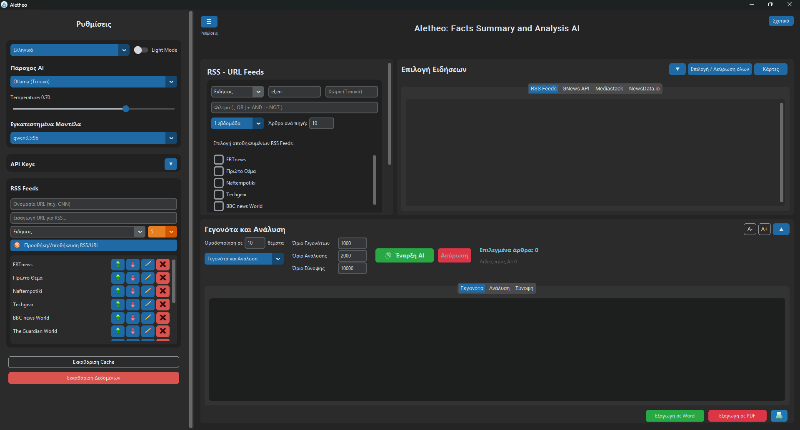
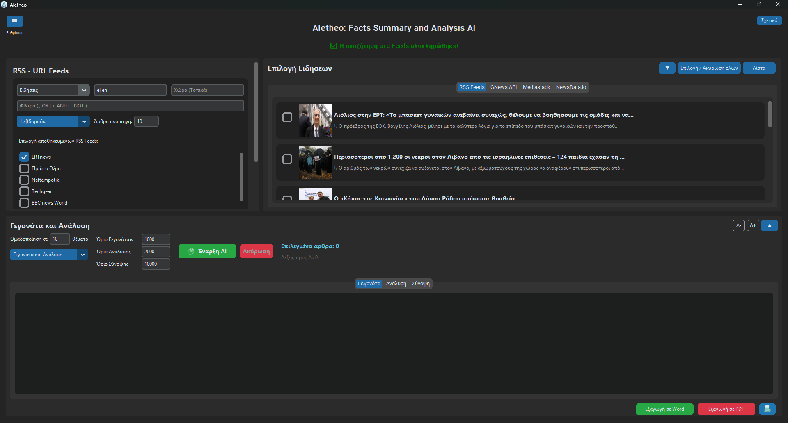
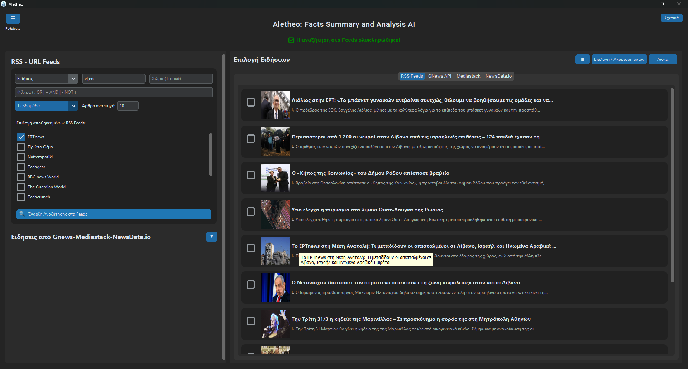
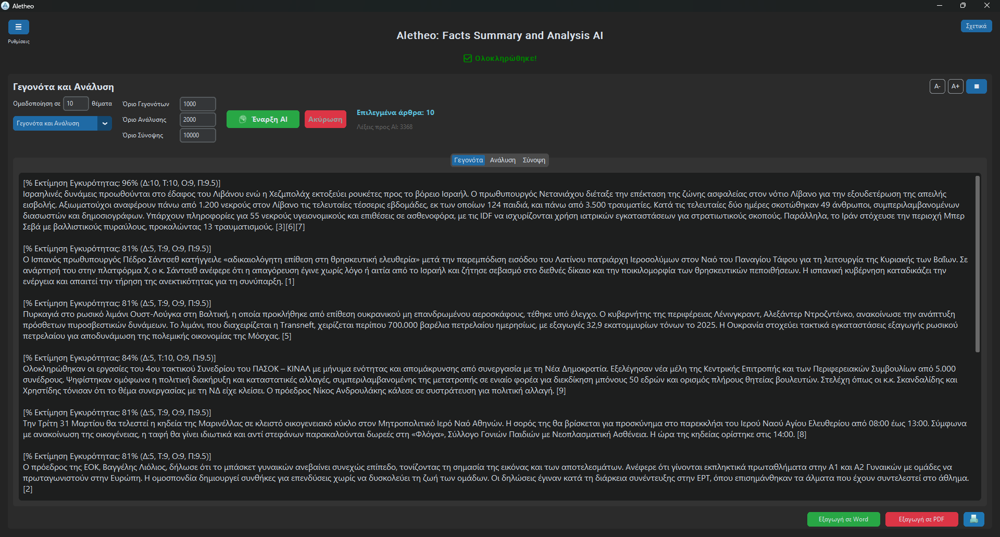
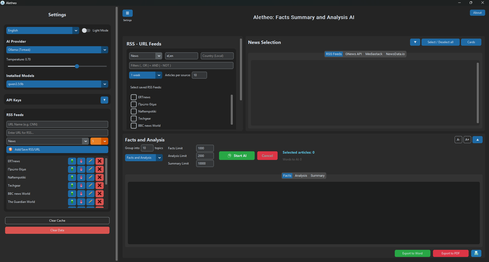
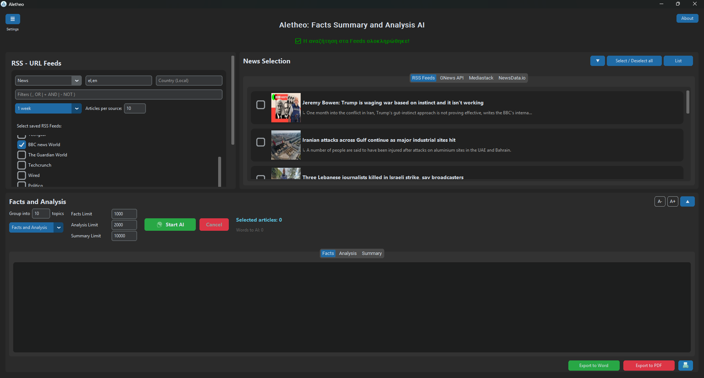
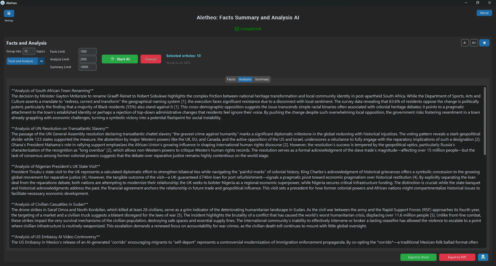

# Aletheo: Σύνοψη & Ανάλυση Γεγονότων με AI


Μια ισχυρή Desktop εφαρμογή (χτισμένη με Python & CustomTkinter) που αυτοματοποιεί την αναζήτηση, το φιλτράρισμα και την ανάλυση ειδήσεων. Λειτουργεί ως ένας προηγμένος ελεγκτής γεγονότων και συλλέκτης ειδήσεων με την ισχύ της Τεχνητής Νοημοσύνης.

Το Aletheo συλλέγει δεδομένα από πολλαπλές πηγές (RSS Feeds, URLs, GNews, Mediastack, NewsData.io), επιτρέπει στον χρήστη να επιμεληθεί τα πιο σχετικά άρθρα, και αξιοποιεί την Τεχνητή Νοημοσύνη (μοντέλα Cloud ή Τοπικά) για να εξάγει γεγονότα, να τα επικυρώνει και να παρέχει στοχευμένη ανάλυση.

## 🌟 Κύρια Χαρακτηριστικά

- **Συλλογή από Πολλαπλές Πηγές**: Αντλήστε ειδήσεις από απλά URLs (μέσω Web Scraping), RSS feeds, και 3 διαφορετικά News APIs (GNews, Mediastack, NewsData.io).
- **Προηγμένο Φιλτράρισμα**: Φιλτράρετε άρθρα τοπικά ανά Κατηγορία, Γλώσσα (με ευρετική ανίχνευση κειμένου), Χώρα, Ημερομηνία, και Λέξεις-κλειδιά (χρησιμοποιώντας `+` για ΥΠΟΧΡΕΩΤΙΚΑ, `-` για ΟΧΙ, και `,` για Ή).
- **Διπλή Υποστήριξη AI**: Χρησιμοποιήστε το Gemini API της Google (Cloud) για κορυφαία αποτελέσματα, ή το Ollama για τοπική εκτέλεση με έμφαση στην ιδιωτικότητα και offline λειτουργία.
- **Μηχανισμός Fact-Checking**: Το AI ομαδοποιεί τις ειδήσεις, αφαιρεί την προκατάληψη, και παράγει μια **Εκτίμηση Εγκυρότητας (1-10)** βασισμένη στη Διασταύρωση, την Τεκμηρίωση, την Ουδετερότητα, και την Αυθεντία της Πηγής.
- **Βαθμολόγηση Αξιοπιστίας**: Αναθέστε τη δική σας "Βαθμολογία Αξιοπιστίας" σε κάθε RSS feed που προσθέτετε, την οποία το AI λαμβάνει αυτόματα υπόψη στην τελική του Εκτίμηση Εγκυρότητας.
- **Δυναμικό UI**: Ένα μοντέρνο, καθαρό και πλήρως αποκριτικό περιβάλλον χρήστη με CustomTkinter που διαθέτει:
  - Light/Dark mode support.
  - Collapsible panels for a tidy workspace.
  - **List & Card Views** for news results, including image thumbnails.
- **Ακυρώσιμες Εργασίες AI**: Ένα ειδικό κουμπί "Ακύρωση" για να σταματάτε τις χρονοβόρες διαδικασίες του AI.
- **Παραμετροποιήσιμη Έξοδος**: Ορίστε τα δικά σας όρια χαρακτήρων για τα Γεγονότα, την Ανάλυση και τη Σύνοψη.
- **Ανατροφοδότηση σε Πραγματικό Χρόνο**: Ένας ζωντανός μετρητής δείχνει πόσα άρθρα έχουν επιλεγεί και το συνολικό πλήθος λέξεων που αποστέλλονται στο AI.
- **Πλούσιες Επιλογές Εξαγωγής**: Εξάγετε άμεσα τα επιμελημένα γεγονότα, την ανάλυση ή τις συνόψεις σας σε **Word (.docx)**, **PDF (.pdf)**, ή απευθείας στον εκτυπωτή σας.

## 🛠️ Απαιτήσεις Εγκατάστασης

1. **Python 3.8+**
2. Κλωνοποιήστε το αποθετήριο:
   ```bash
   git clone https://github.com/stratoslig/Aletheo-Facts-Summary-and-Analysis-AI.git
   cd Aletheo-Facts-Summary-and-Analysis-AI
   ```
3. Εγκαταστήστε τις απαιτούμενες εξαρτήσεις:
   ```bash
   pip install -r requirements.txt
   ```
   *(Βεβαιωθείτε ότι έχετε εγκαταστήσει βιβλιοθήκες όπως `customtkinter`, `google-genai`, `ollama`, `feedparser`, `cloudscraper`, `beautifulsoup4`, `python-docx`, `reportlab`, `pillow`).*

## 🚀 Γρήγορη Εκκίνηση

1. Τρέξτε την εφαρμογή:
   ```bash
   python appFSA.py
   ```
2. **Ρυθμίστε τα API Keys σας**: Ανοίξτε την αριστερή πλαϊνή μπάρα και εισάγετε το Gemini API key σας (ή αλλάξτε σε Ollama αν το έχετε εγκαταστήσει τοπικά). Μπορείτε επίσης να προσθέσετε δωρεάν API keys για τα GNews, Mediastack, και NewsData.io. Κάντε κλικ στο **Αποθήκευση Κλειδιών**.
3. **Προσθέστε Πηγές**: Προσθέστε μερικά RSS feeds ή απλά URLs ειδήσεων στην πλαϊνή μπάρα. Αναθέστε τους μια κατηγορία και μια Βαθμολογία Αξιοπιστίας.
4. **Αναζήτηση**: Χρησιμοποιήστε το πάνελ "Επιλογή Πηγών" (πάνω αριστερά) για να φιλτράρετε με βάση το επιθυμητό θέμα και κάντε κλικ στο "Αναζήτηση".
5. **Επιλογή**: Τσεκάρετε τα κουτάκια δίπλα στα άρθρα που σας ενδιαφέρουν στο δεξί πάνελ.
6. **Ανάλυση**: Στο κάτω πάνελ, επιλέξτε σε πόσα θέματα θέλετε να ομαδοποιηθούν, επιλέξτε την εργασία (π.χ., Γεγονότα και Ανάλυση), και πατήστε **Έναρξη**.
7. **Εξαγωγή**: Χρησιμοποιήστε τα κουμπιά κάτω δεξιά για να αποθηκεύσετε το αποτέλεσμα του AI σε PDF ή Word!

## 🌍 Υποστηριζόμενες Γλώσσες
Το περιβάλλον χρήστη και η μηχανή δημιουργίας Prompts υποστηρίζουν πλήρως **Αγγλικά** και **Ελληνικά**. Η λογική μετάφρασης μπορεί εύκολα να επεκταθεί στο `translations.py`.

## 📸 Στιγμιότυπα Οθόνης

*Κύριο παράθυρο εφαρμογής σε Dark Mode, που δείχνει την προβολή καρτών για τα αποτελέσματα των ειδήσεων.*



*Το πάνελ αποτελεσμάτων με τα παραγόμενα γεγονότα και την ανάλυση.*


## 📝 Βιβλιοθήκες που Χρησιμοποιήθηκαν
- **CustomTkinter**: Μοντέρνο GUI.
- **Trafilatura & BeautifulSoup**: Ισχυρό Web Scraping.
- **Python-docx & ReportLab**: Δημιουργία εγγράφων.
- **Feedparser**: Ανάλυση RSS.
- **Google-GenAI & Ollama**: Επεξεργασία AI.

## 📜 Άδεια Χρήσης
Αυτό το έργο αδειοδοτείται υπό την Άδεια MIT - δείτε το αρχείο LICENSE για λεπτομέρειες.

---

# Aletheo: Facts Summary and Analysis AI

A powerful Desktop application (built with Python & CustomTkinter) that automates the search, filtering, and analysis of news. It acts as an advanced AI-powered fact-checker and aggregator.

Aletheo gathers data from multiple sources (RSS Feeds, URLs, GNews, Mediastack, NewsData.io), allows the user to curate the most relevant articles, and leverages Artificial Intelligence (Cloud or Local models) to extract facts, validate them, and provide targeted analysis.

## 🌟 Key Features

- **Multi-Source Aggregation**: Fetch news from raw URLs (via Web Scraping), RSS feeds, and 3 distinct News APIs (GNews, Mediastack, NewsData.io).
- **Advanced Filtering**: Filter articles locally by Category, Language (with heuristic text detection), Country, Date, and Keywords (using `+` for MUST, `-` for NOT, and `,` for OR).
- **Dual AI Support**: Use Google's Gemini API (Cloud) for top-tier results, or Ollama for local, privacy-first, offline execution.
- **Fact-Checking Engine**: The AI groups the news, strips out bias, and generates a **Validity Estimate (1-10)** based on Cross-referencing, Documentation, Neutrality, and Source Authority.
- **Trust Scoring**: Assign your own custom "Trust Score" to each RSS feed you add, which the AI automatically factors into its final Validity Estimate.
- **Dynamic UI**: A modern, clean, and fully responsive User Interface using CustomTkinter with:
  - Light/Dark mode support.
  - Collapsible panels for a tidy workspace.
  - **List & Card Views** for news results, including image thumbnails.
- **Cancellable AI Tasks**: A dedicated "Cancel" button to stop long-running AI processes.
- **Configurable Output**: Set your own character limits for Facts, Analysis, and Summary outputs.
- **Real-time Feedback**: A live counter shows how many articles are selected and the total word count being sent to the AI.
- **Rich Export Options**: Instantly export your curated facts, analysis, or summaries to **Word (.docx)**, **PDF (.pdf)**, or directly to your printer.

## 🛠️ Installation Requirements

1. **Python 3.8+**
2. Clone the repository:
   ```bash
   git clone https://github.com/stratoslig/Aletheo-Facts-Summary-and-Analysis-AI.git
   cd Aletheo-Facts-Summary-and-Analysis-AI
   ```
3. Install the required dependencies:
   ```bash
   pip install -r requirements.txt
   ```
   *(Ensure you have libraries like `customtkinter`, `google-genai`, `ollama`, `feedparser`, `cloudscraper`, `beautifulsoup4`, `python-docx`, `reportlab`, `pillow` installed).*

## 🚀 Quick Start

1. Run the application:
   ```bash
   python appFSA.py
   ```
2. **Setup your API Keys**: Open the left sidebar and enter your Gemini API key (or switch to Ollama if installed locally). You can also add free API keys for GNews, Mediastack, and NewsData.io. Click **Save Keys**.
3. **Add Sources**: Add some RSS feeds or regular News URLs in the sidebar. Assign them a category and a Trust Score.
4. **Search**: Use the "Source Selection" panel (top-left) to filter by your desired topic and click "Search".
5. **Select**: Check the boxes next to the articles you find interesting in the right panel.
6. **Analyze**: In the bottom panel, choose how many topics you want to group them into, select the task (e.g., Facts and Analysis), and hit **Start**.
7. **Export**: Use the buttons at the bottom right to save the AI's output to PDF or Word!

## 🌍 Languages Supported
The User Interface and AI Prompting Engine fully support **English** and **Greek** out of the box. The translation logic can be easily extended in `translations.py`.

## 📸 Screenshots

*Main application window in Dark Mode, showing the card view for news results.*



*The results panel with generated facts and analysis.*


## 📝 Libraries Used
- **CustomTkinter**: Modern GUI.
- **Trafilatura & BeautifulSoup**: Robust Web Scraping.
- **Python-docx & ReportLab**: Document generation.
- **Feedparser**: RSS Parsing.
- **Google-GenAI & Ollama**: AI Processing.

## 📜 License
This project is licensed under the MIT License - see the LICENSE file for details.
